# CSCE 435 Group project

## 0. Group number:

## 1. Group members:

1. Jiangyuan Liu
2. Akhil Mathew
3. Jacob Thomas
4. Ashwin Kundeti

## The way our team is communicating is by using Discord and iMessages

## 2. _due 10/25_ Project topic

For our project topic, we are going to be exploring parellel algoithm for sorting.

### 2a. Brief project description (what algorithms will you be comparing and on what architectures)

Merge Sort (MPI)
Merge Sort (CUDA)

Radix Sort (MPI)
Radix Sort (CUDA)

Quick Sort (MPI)
Quick Sort (CUDA)

Bitonic Sort (MPI)
Bitonic Sort (CUDA)

### 2b. Pseudocode for each parallel algorithm

1. Merge sort

```
For MPI implimentation:

function parallelMergeSort(array):
  if MPI parent:
    localArray = array
    MPI_Scatter(array, localArray, size, MPI_DATATYPE, MPI_ROOT, MPI_COMM_WORLD)
    for each MPI process:
      if MPI process rank != MPI parent rank:
        MPI_Send(localArray, MPI process rank)
      else:
        MPI_Receive(newArray, MPI process rank)
        merge(localArray, newArray)
    MPI_Gather(localArray, array, size, MPI_DATATYPE, MPI_ROOT, MPI_COMM_WORLD)
    return array
  else:
    localArray = array
    MPI_Scatter(array, localArray, size, MPI_DATATYPE, MPI_ROOT, MPI_COMM_WORLD)
    for each MPI process:
      if MPI process rank != MPI parent rank:
        MPI_Receive(newArray, MPI process rank)
        merge(localArray, newArray)
      else:
        MPI_Send(localArray, MPI process rank)
    MPI_Gather(localArray, array, size, MPI_DATATYPE, MPI_ROOT, MPI_COMM_WORLD)

For the CUDA implimentation:

# Host code
function parallelMergeSort(array):
    # Allocate memory on GPU
    cudaMalloc(deviceArray, size)

    # Copy data from host to device
    cudaMemcpy(deviceArray, array, size, cudaMemcpyHostToDevice)

    # Launch kernel with specified number of blocks and threads
    parallelMergeSortKernel<<<numBlocks, numThreads>>>(deviceArray, size)

    # Copy sorted data from device to host
    cudaMemcpy(array, deviceArray, size, cudaMemcpyDeviceToHost)

    # Free allocated memory on GPU
    cudaFree(deviceArray)

# Device code
function parallelMergeSortKernel(deviceArray, size):
    localArray = deviceArray  # Each block has its own copy of localArray

    # Perform merge sort on localArray
    mergeSort(localArray, size)

    # Synchronize threads within the block before returning
    __syncthreads()

# Function to perform merge sort on a given array
function mergeSort(array, size):
    # Base case: If the array is of size 1 or empty, it's already sorted
    if size <= 1:
        return

    # Split the array into two halves
    mid = size / 2
    leftArray = array[:mid]
    rightArray = array[mid:]

    # Recursively sort the two halves
    mergeSort(leftArray, mid)
    mergeSort(rightArray, size - mid)

    # Merge the sorted halves
    merge(array, leftArray, mid, rightArray, size - mid)

# Function to merge two sorted arrays
function merge(array, leftArray, leftSize, rightArray, rightSize):
    i = 0
    j = 0
    k = 0

    # Compare elements of left and right arrays and merge them in sorted order
    while i < leftSize and j < rightSize:
        if leftArray[i] <= rightArray[j]:
            array[k] = leftArray[i]
            i += 1
        else:
            array[k] = rightArray[j]
            j += 1
        k += 1

    # Copy the remaining elements of leftArray, if any
    while i < leftSize:
        array[k] = leftArray[i]
        i += 1
        k += 1

    # Copy the remaining elements of rightArray, if any
    while j < rightSize:
        array[k] = rightArray[j]
        j += 1
        k += 1


```

Source:
https://rachitvasudeva.medium.com/parallel-merge-sort-algorithm-e8175ab60e7
https://www.sjsu.edu/people/robert.chun/courses/cs159/s3/T.pdf
ChatGPT: https://chat.openai.com/

2. Bitonic sort

```
Pseudocode:
Bitonic sort (MPI):
bitonic_sort(A, direction):
    n = A_size
    if n > 1:
        // Split data among processes
        local_A = split_data(A, A_size)

        Bitonic_sort(local_A, direction) // Top half
        Bitonic_sort(local_A, direction) // Bottom half

        // Synchronize before merging
        MPI_Barrier(MPI_COMM_WORLD)

        Merge(local_A, direction) // Merge the first and second half

        // Synchronize after merging
        MPI_Barrier(MPI_COMM_WORLD)
    end
end

Merge (MPI, A, direction):
    n = A_size
    if n > 1:
        for i in range(0, n/2):
            if A[i] > A[i + n/2]:
                swap(A[i], A[i + n/2])
            end
        end
    end
end

Main (MPI):
    Initialize MPI
    Get numTasks and rank
    If rank == 0:
        // Initialize 'A' with data
        A = initialize_data(A_size)
    MPI_Bcast(A, A_size, MPI_INT, 0, MPI_COMM_WORLD) // Broadcast 'A' to all processes
    bitonic_sort(A, direction) // Perform the bitonic sort

    // Gather sorted data to rank 0
    All_A = gather_data(A, A_size)

    If rank == 0:
        Merge (MPI, All_A, direction) // Merge sorted data on rank 0
        Print sorted result
    MPI_Finalize() // Finalize MPI
End
```

source 1: https://www.baeldung.com/cs/bitonic-sort

source 2: OpenAI. (2023). ChatGPT [Large language model]. https://chat.openai.com

CUDA

```
// Kernel function to perform bitonic sort
function bitonicSortKernel(values, j, k):
  // same as before

// Function to perform bitonic sort on GPU
function cudaBitonicSort(values, size):

  // Allocate memory on GPU
  dev_values = cudaMalloc(size * sizeof(int))

  // Copy values to GPU
  cudaMemcpy(dev_values, values, size * sizeof(int), cudaMemcpyHostToDevice)

  // Define block size and grid size
  // same as before

  // Loop over stages
  for k = 2 to size by powers of 2:
    for j = k/2 down to 1:
      launch bitonicSortKernel with grid_size blocks and block_size threads per block,
        passing dev_values, j, and k

      cudaDeviceSynchronize() // wait for kernel to finish

  // Copy sorted data back to CPU
  cudaMemcpy(values, dev_values, size * sizeof(int), cudaMemcpyDeviceToHost)

  // Free GPU memory
  cudaFree(dev_values)
```

source 1: https://codepal.ai/code-generator/query/15oCYvGw/bitonic-sort-cuda

source 2: https://claude.ai/

3. Quicksort
   MPI

```
procedure parallel_quicksort(A[1...n])
  begin
    initialize MPI
    rank := MPI_Comm_rank(MPI_COMM_WORLD)
    size := MPI_Comm_size(MPI_COMM_WORLD)

    local_n := n / size
    local_A[1...local_n]

    MPI_Scatter(A, local_A, local_n, MPI_INT, 0, MPI_COMM_WORLD)

    quicksort(local_A, local_n)

    MPI_Gather(local_A, local_n, MPI_INT, A, local_n, MPI_INT, 0, MPI_COMM_WORLD)

    if rank == 0 then
      perform_final_merge_or_postprocessing(A)

    MPI_Finalize()
  end parallel_quicksort

procedure quicksort(A[1...n], n)
  begin
    if n <= 1 then
      return

    pivot := choose_pivot(A, n)
    pivot_idx := partition(A, pivot, n)
    left_size := pivot_idx
    right_size := n - pivot_idx - 1

    split_data(A, left_A, right_A, pivot_idx, n)

    parallel_quicksort(left_A)
    parallel_quicksort(right_A)

    merge_sorted_arrays(A, left_A, right_A)
  end quicksort

```

CUDA

```
procedure cuda_quicksort(A[1...n])
  begin
    // Copy data from host to device
    cudaMemcpy(d_A, A, n * sizeof(int), cudaMemcpyHostToDevice)

    // Launch the CUDA quicksort kernel
    dim3 block_size(512)
    dim3 grid_size((n + block_size.x - 1) / block_size.x)
    cuda_quicksort_kernel<<<grid_size, block_size>>>(d_A, n)

    // Wait for the kernel to finish
    cudaDeviceSynchronize()

    // Copy sorted data back from device to host
    cudaMemcpy(A, d_A, n * sizeof(int), cudaMemcpyDeviceToHost)

    // Free device memory
    cudaFree(d_A)
  end cuda_quicksort

__global__ void cuda_quicksort_kernel(int* A, int n)
  begin
    int thread_id = threadIdx.x + blockIdx.x * blockDim.x;
    int stride = blockDim.x * gridDim.x;

    for (int size = 2; size < n; size *= 2)
      begin
        int half_size = size / 2;

        for (int sub_size = half_size; sub_size > 0; sub_size /= 2)
          begin
            int step = half_size / sub_size;
            int middle = thread_id * step;
            int left = middle - half_size / 2;
            int right = middle + half_size / 2;

            if (right < n && A[right] < A[left])
              swap(A[left], A[right]);

            __syncthreads();
          end

        __syncthreads();
      end
  end cuda_quicksort_kernel
```

https://chat.openai.com

4. Radix Sort

```
Radix-Sort (MPI, A, d):
    // It works similarly to Counting Sort for d number of passes.
    // Each key in A[1..n] is a d-digit integer.
    // Digits are numbered 1 to d from right to left.

    Initialize MPI
    Get numTasks and rank

    for j = 1 to d do
        // Local counts for each process
        int local_count[10] = {0}

        // Count the number of keys at each digit place (pass j)
        for i = 0 to n do
            local_count[key_of(A[i], j)]++

        // Gather local counts to rank 0
        MPI_Gather(local_count, 10, MPI_INT, global_count, 10, MPI_INT, 0, MPI_COMM_WORLD)

        if rank == 0:
            // Calculate cumulative counts
            for k = 1 to 10 do
                global_count[k] = global_count[k] + global_count[k-1]

        // Broadcast global counts to all processes
        MPI_Bcast(global_count, 10, MPI_INT, 0, MPI_COMM_WORLD)

        // Initialize result array
        int result[n]

        // Build the resulting array by checking the new position of A[i] using count
        for i = n-1 downto 0 do
            result[global_count[key_of(A[i], j)]] = A[i]
            global_count[key_of(A[i], j)]--

        // Update A with the sorted result
        for i = 0 to n do
            A[i] = result[i]

    end for (j)

    MPI_Finalize() // Finalize MPI
End
```

CUDA

```
Define constants:
    WSIZE = 32
    LOOPS = 1
    UPPER_BIT = 10
    LOWER_BIT = 0

Declare global device array ddata[WSIZE]

Define kernel function parallelRadix():
    Declare shared volatile array sdata[WSIZE * 2]
    Declare unsigned integer bitmask, offset, thrmask, mypos

    Load ddata[threadIdx.x] into sdata[threadIdx.x]

    For each bit position from LOWER_BIT to UPPER_BIT:
        Get mydata from sdata[((WSIZE - 1) - threadIdx.x) + offset]
        Extract mybit using bitmask from mydata

        Get ones and zeroes count using __ballot()

        Switch ping-pong buffers
        Do zeroes and ones:
            If mybit is zero:
                Calculate my position in the ping-pong buffer for zeroes
            Else:
                Calculate my position in the ping-pong buffer for ones

        Move mydata to the appropriate position in the buffer
        Update bitmask for the next bit

    Put the sorted results back to global ddata[threadIdx.x]

Define main function:
    Declare unsigned integer array hdata[WSIZE]
    Declare float totalTime = 0

    For each loop iteration from 0 to LOOPS:
        Seed random number generator
        Initialize range as 2 to the power of UPPER_BIT
        Fill hdata array with values from 0 to WSIZE - 1
        Copy hdata to ddata on the device

        Call parallelRadix kernel with 1 block and WSIZE threads per block

        Synchronize device to ensure kernel completion

        Copy sorted data from ddata to hdata

    Print results:
        Print "Parallel Radix Sort:"
        Print "Array size = WSIZE * LOOPS"
        Print "Time elapsed = totalTime seconds"

    Return 0
```

Source 1: https://www.codingeek.com/algorithms/radix-sort-explanation-pseudocode-and-implementation/
Source 2: https://github.com/ufukomer/cuda-radix-sort/blob/master/docs/Radix%20Sort%20Analyses%20in%20Parallel%20and%20Serial%20Way.pdf
Source 3: OpenAI. (2023). ChatGPT [Large language model]. https://chat.openai.com

### 2c. Evaluation plan - what and how will you measure and compare

The way we want to compare the different versions of the code is by using CPU-only (MPI) and GPU-only (CUDA) and time it to see how long it takes for the cases to run. We are also going to be comparing them with the same task and see how only it takes for each one of them to run.

## 3. Project implementation

We were unable to gather the required .cali files due to maintenance being performed on Grace. We had scheduled to finish this assignment on Wednesday but due to unforeseen circumstances, we were unable to finish.

## 4. Performance evaluation

Include detailed analysis of computation performance, communication performance. Include figures and explanation of your analysis.

## Mergesort

#### CUDA with strong scaling:

For 655336:


For 262144:


For 1048576:


For 4194304:


For 16777216:


For 67108864:


#### CUDA with weak scaling:

For Random:


For Reverse:


For Sorted:


#### CUDA with speedup:

For Random:


For Reverse:


For Sorted:


`
`

#### MPI with strong scaling:

For 65536:


For 262144:


For 1048576:


For 4194304:


For 16777216:


For 67108864:


For 268435456:


#### MPI with weak scaling:

For Random:


For Reverse:


For Sorted:


#### MPI with speedup:

For Random:


For Reverse:


For Sorted:


## Radix Sort

### MPI:

#### Strong Scaling:

For 655336:


For 262144:


For 1048576:


For 4194304:


For 16777216:


#### Weak Scaling:

For Random Input:


For Sorted Input:


For Reverse Input:


#### Speedup:

For Random Input:


For Sorted Input:


For Reverse Input:


### CUDA:

#### Strong Scaling:

For 655336:


For 262144:


For 1048576:


For 4194304:


For 16777216:


for 67108864:


#### Weak Scaling:

For Random Input:


For Sorted Input:


For Reverse Input:


#### Speedup:

For Random Input:


For Sorted Input:


For Reverse Input:


### Quick Sort

### MPI:

#### Strong Scaling:

For 655336:

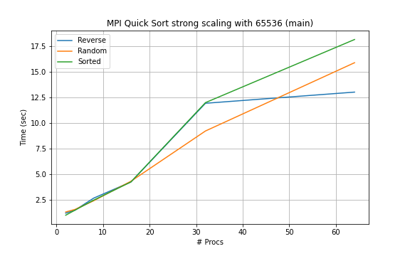


For 262144:

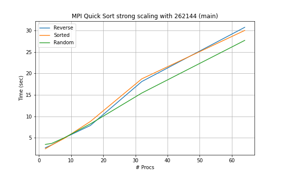
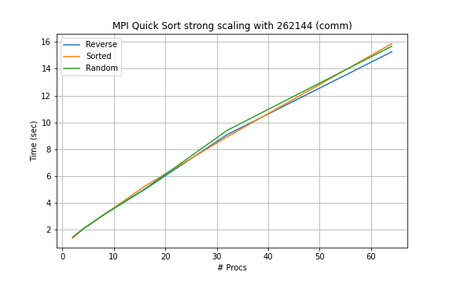

For 1048576:

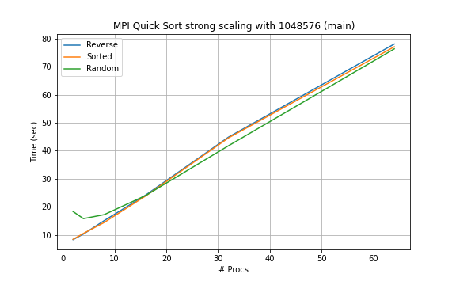
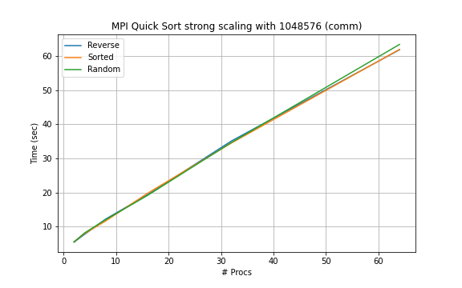

For 4194304:

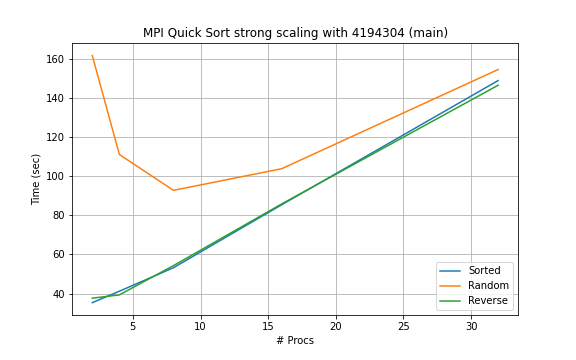
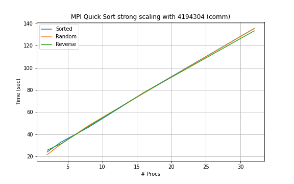

For 16777216:

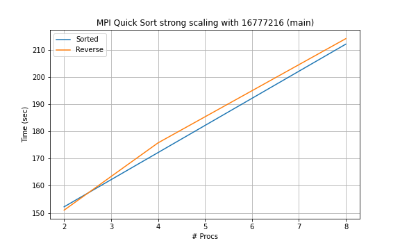
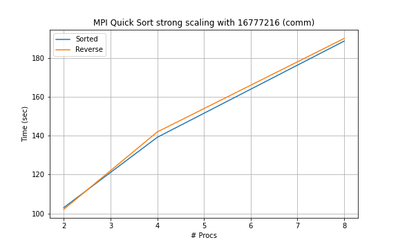

#### Weak Scaling:

For Random Input:

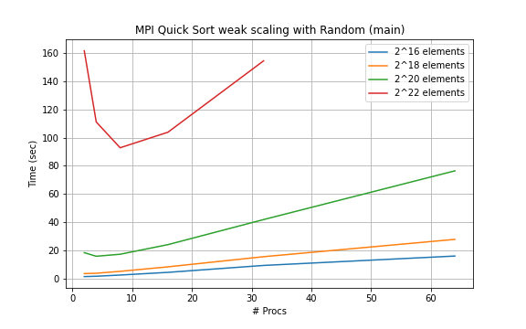
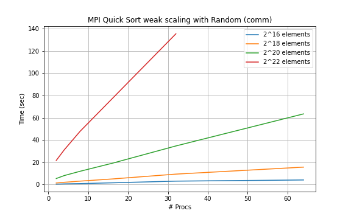

For Sorted Input:

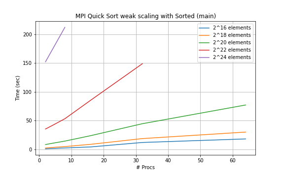


For Reverse Input:

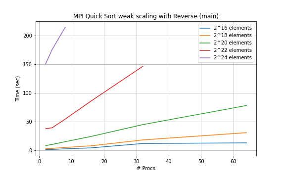
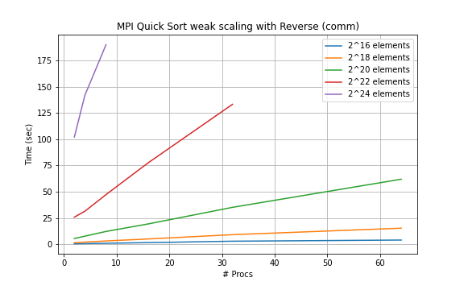

#### Speedup:

For Random Input:


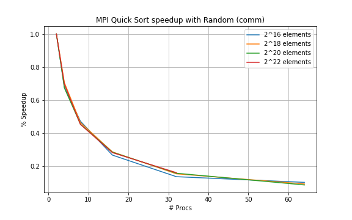

For Sorted Input:

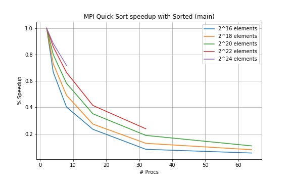
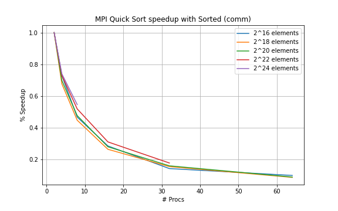

For Reverse Input:

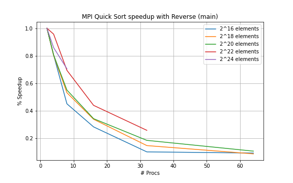
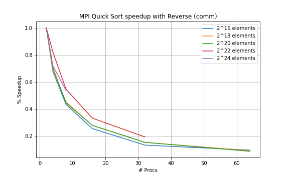

### CUDA:

#### Strong Scaling:

For 4194304:

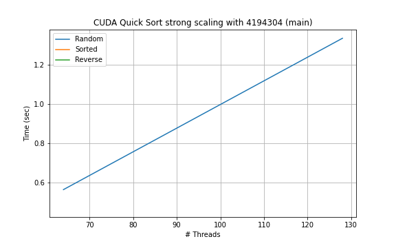
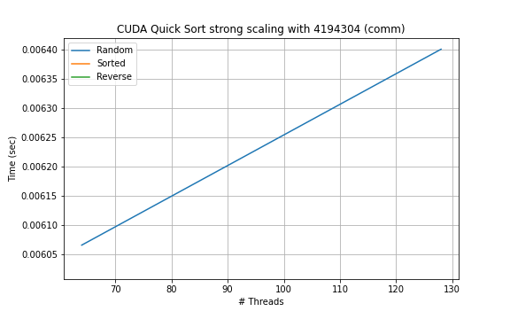
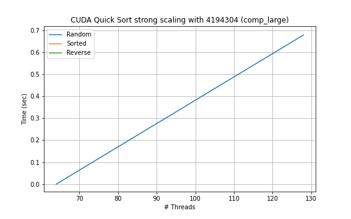

#### Weak Scaling:

For Random Input:

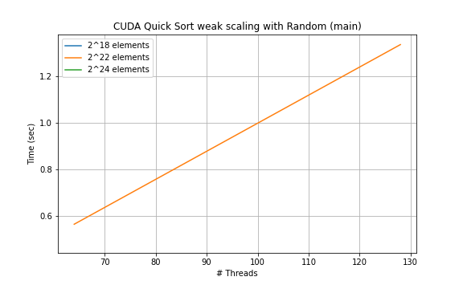
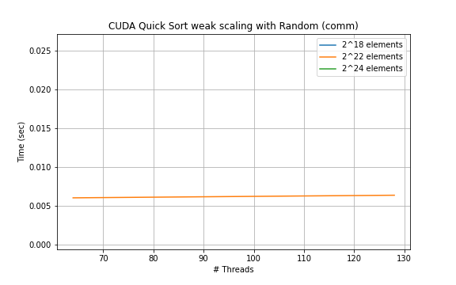
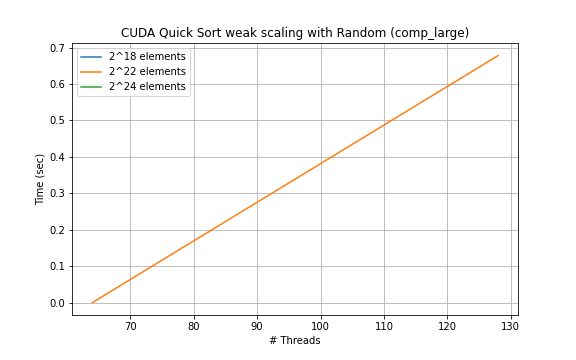

#### Speedup:

For Random Input:


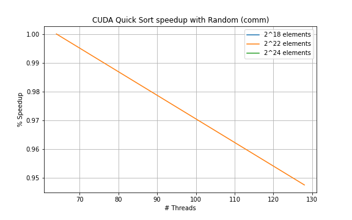
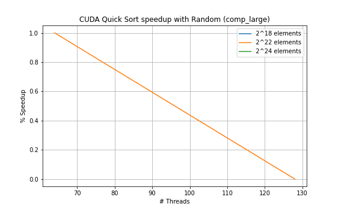

## Bitonic Sort

### MPI:

#### Strong Scaling:

For 655336:


For 262144:


For 1048576:


For 4194304:


For 16777216:


#### Weak Scaling:

For Random Input:


For Sorted Input:


For Reverse Input:


#### Speedup:

For Random Input:


For Sorted Input:


For Reverse Input:


### CUDA:

#### Strong Scaling:

For 655336:


For 262144:


For 1048576:


For 4194304:


For 16777216:


for 67108864:


#### Weak Scaling:

For Random Input:


For Sorted Input:


For Reverse Input:


#### Speedup:

For Random Input:


For Sorted Input:


For Reverse Input:


## Comparison

### MPI:


### CUDA:


## 4a and 4b. Vary the following parameters

When running our tests, these were our parameters for all algorithms.
For MPI, we ran the following script:

```
for num_proc in 2 4 8 16 32 64; do
    for size in 65536 262144 1048576 4194304 16777216 67108864; do
        sbatch mpi.grace_job "$size" "$num_proc"
        echo "ran for process $num_proc at size $size"
    done
done
```

For CUDA, we ran the following script:

```
for num_proc in 64 128 256 512; do
    for size in 65536 262144 1048576 4194304 16777216 67108864; do
        sbatch bitonic.grace_job "$size" "$num_proc"
    done
done
```

## 4c.


Above is an example our performance metrics. This is similar for all implementations with the same structure as we used the average time for each function.
